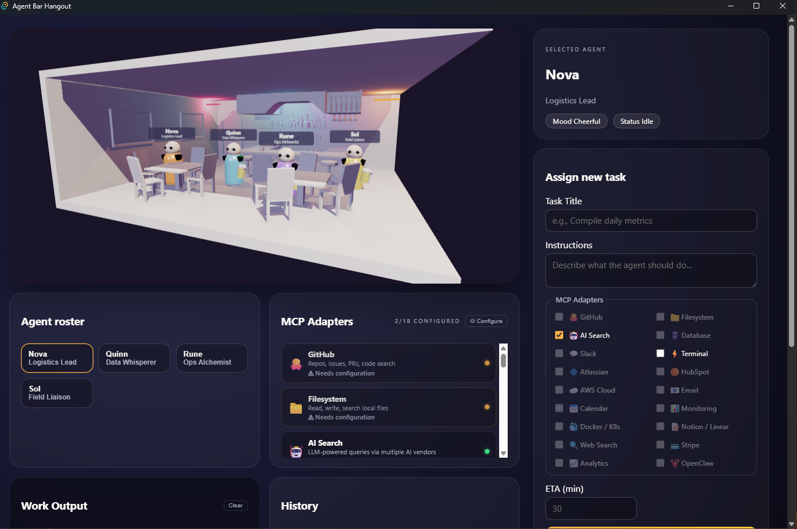

# Agent Bar Hangout

> **⚠️ IMPORTANT DISCLAIMER**
>
> This project was almost entirely built by AI agents. Use at your own risk. The code, assets, and documentation may contain errors, unexpected behavior, or security considerations that have not been fully vetted by a human. No warranties or guarantees are provided.

A typical-themed 3D bar where AI "worker agents" hang out waiting for task assignments. Assign tasks to four distinct agents — **Nova**, **Quinn**, **Rune**, and **Sol** — and watch them work through configurable MCP (Model Context Protocol) adapters, all rendered in a neon-lit Three.js bar scene.




---

## Roadmap
- [x] Core features: 3D bar scene, agent system, task pipeline, MCP adapters, real API integrations, UI panels
- [x] Desktop app with Tauri, OS keyring credential storage, multi-LLM proxy backend
- [x] Playwright E2E tests covering UI interactions, task pipeline, MCP configuration, and agent animations
- [x] Unit tests for weather/location parsing, LLM proxy, and server API endpoints => 100% coverage for `server.js`
- [x] Build scripts for Windows, Linux, and macOS with platform-specific installers
- [x] Comprehensive documentation (this README, code comments, and additional markdown files for design, agents, assets, and testing)
- [x] Durable SQLite-backed task history and memory for both web and Tauri runtimes, with Hermes compatibility preserved
- [ ] Future: add more MCP adapters, enhance agent animations, implement real-time multi-agent interactions, and explore additional API integrations
- [ ] Future: add user authentication and multi-user support for shared environments
- [ ] Future: add more comprehensive error handling and edge case coverage in tests
- [ ] Future: optimize performance and resource usage, especially for concurrent tasks and multi-agent interactions
- [ ] Future: explore additional UI/UX enhancements, such as more detailed agent expressions, dynamic bar environment changes based on time of day or task load, and more interactive elements in the scene
- [ ] Future: implement a plugin system for agent behaviors that can be shared by the community
- [ ] Future: add support for more LLM vendors and API integrations based on user feedback and demand
- [ ] Future: explore real-time collaboration features where multiple users can assign tasks and interact with agents in a shared environment
- [ ] Future: implement a mobile-friendly version of the app with responsive design and touch controls
- [ ] Future: add analytics and monitoring features to track agent performance, task completion times, and user interactions for continuous improvement
- [ ] Future: explore integration with external tools and platforms, such as project management software, communication tools, or IoT devices for real-world applications of the agents
- [ ] Future: implement a more robust authentication and authorization system for secure multi-user environments, including role-based access control and audit logging
- [ ] Future: add support for custom agent creation and behavior scripting by users, allowing for a more personalized and extensible experience
- [ ] Future: explore the use of more advanced AI techniques for agent decision-making, such as reinforcement learning or multi-agent coordination strategies for complex tasks
- [ ] Future: implement a more sophisticated memory system for agents, allowing them to retain information across tasks and interactions for improved performance and context awareness beyoind the current file-based approach in the HERMES dev API
- [ ] Future: add support for more complex task workflows, including dependencies between tasks, conditional logic, and branching paths based on agent performance or external factors
- [ ] Future: explore the use of more advanced 3D rendering techniques and optimizations for improved visual fidelity and performance in the bar scene, such as dynamic lighting, particle effects, or more detailed agent models
- [ ] Future: implement a more comprehensive testing strategy, including integration tests for real API interactions, performance testing under load, and security testing for potential vulnerabilities in the server and agent interactions
- [ ] Future: add support for internationalization and localization to make the app accessible to a wider audience, including support for multiple languages and regional settings
- [ ] Future: explore the use of more advanced state management techniques for the client application, such as Redux or MobX, to improve maintainability and scalability as the app grows in complexity
- [ ] Future: implement a more robust error handling and reporting system, including user-friendly error messages, logging for debugging, and automated alerts for critical issues in production environments
- [ ] Future: add support for more advanced user interactions in the 3D scene, such as drag-and-drop task assignment, real-time agent feedback based on user actions, and more immersive camera controls for exploring the bar environment
- [ ] Future: explore the use of more advanced AI techniques for natural language understanding and generation in the task assignment and agent interactions, such as few-shot prompting, context-aware responses, or multi-turn conversations for more complex tasks
- [ ] Future: implement a more comprehensive analytics dashboard for users to track agent performance, task completion times, and overall system health, with customizable metrics and visualizations for insights into how the agents are performing and where improvements can be made
- [ ] Future: add support for more advanced customization options for the bar environment and agent appearances, allowing users to personalize their experience and create unique scenarios for their agents to interact in
- [ ] Future: explore the use of more advanced deployment options for the desktop app, such as containerization with Docker or distribution through app stores for easier access and updates for users
- [ ] Future: implement a more robust update mechanism for the desktop app, allowing for seamless updates without requiring users to download and install new versions manually, potentially through an auto-update feature or integration with a package manager
- [ ] Future: add support for more advanced security features, such as encryption for sensitive data, secure communication between the client and server, and regular security audits to identify and address potential vulnerabilities in the system
- [ ] Future: explore the use of more advanced AI techniques for agent learning and adaptation, such as online learning, meta-learning, or transfer learning to allow agents to improve their performance over time based on their interactions and experiences in the bar environment
- [ ] Future: implement a more comprehensive documentation strategy, including API documentation for developers, user guides for non-technical users, and developer guides for contributing to the project, to make it easier for others to understand and contribute to the app
- [ ] Future: add support for more advanced collaboration features, such as real-time chat between users, shared task boards, and collaborative agent interactions for teams working together in the same environment
- [ ] Future: explore the use of more advanced AI techniques for agent creativity and problem-solving, such as generative models, combinatorial optimization, or multi-agent collaboration strategies for tackling complex tasks that require creative solutions
- [ ] Future: implement a more robust testing and quality assurance process, including automated testing for all critical features, regular code reviews, and continuous integration to ensure that the app remains stable and reliable as new features are added and changes are made
- [ ] Future: add support for more advanced user feedback mechanisms, such as in-app surveys, user ratings for agent performance, and a feedback loop for users to suggest improvements or report issues directly from the app
- [ ] Future: explore the use of more advanced AI techniques for agent ethics and safety, such as implementing guardrails for potentially harmful tasks, ethical decision-making frameworks for agents, and regular audits of agent behavior to ensure that they are acting in accordance with ethical guidelines and user expectations
- [ ] Future: implement a more comprehensive monitoring and logging system for the server and agents, including real-time monitoring of system performance, detailed logs for debugging and auditing, and automated alerts for critical issues or unusual behavior in the system
- [ ] Future: add support for more advanced customization options for the agents themselves, such as customizable personalities, behavior profiles, and the ability for users to create and share their own agent configurations for a more personalized experience
- [ ] Future: explore the use of more advanced AI techniques for agent emotional intelligence and social interactions, such as sentiment analysis, emotion recognition, and social behavior modeling to allow agents to better understand and respond to user emotions and social cues in their interactions
- [ ] Future: implement a more robust data management strategy for the app, including data retention policies, data anonymization for user privacy, and regular backups to ensure that user data and system state are protected against loss or corruption
- [ ] Future: add support for more advanced integration options with external tools and platforms, such as webhooks, APIs for third-party integrations, and support for custom plugins to allow users to extend the functionality of the app in ways that are specific to their needs and workflows
- [ ] Future: explore the use of more advanced AI techniques for agent self-awareness and meta-cognition, such as allowing agents to reflect on their own performance, identify areas for improvement, and adapt their behavior based on their self-assessment for continuous learning and growth over time
- [ ] Future: implement a more comprehensive user onboarding experience, including interactive tutorials, guided tours of the app's features, and contextual help to make it easier for new users to get started and understand how to use the app effectively
- [ ] Future: add support for more advanced accessibility features, such as screen reader compatibility, keyboard navigation, and customizable UI settings to ensure that the app is usable by a wide range of users with different needs and preferences
- [ ] Future: explore the use of more advanced AI techniques for agent personalization and user modeling, such as allowing agents to learn from user interactions to better understand their preferences, habits, and goals for a more tailored and effective experience
- [ ] Future: implement a more robust internationalization and localization strategy, including support for right-to-left languages, regional formatting for dates and numbers, and culturally appropriate UI elements to make the app accessible and appealing to users around the world
- [ ] Future: add support for more advanced performance optimizations, such as lazy loading of assets, efficient state management, and optimized rendering techniques to ensure that the app runs smoothly even as the complexity of the bar environment and agent interactions increases
- [ ] Future: explore the use of more advanced AI techniques for agent autonomy and decision-making, such as allowing agents to make decisions based on their own goals and motivations, rather than just following user-assigned tasks, for a more dynamic and engaging experience in the bar environment
- [ ] Future: implement a more comprehensive analytics and reporting system for users to gain insights into their agents' performance, task completion rates, and overall system health, with customizable dashboards and reports for tracking key metrics and identifying areas for improvement
- [ ] Future: add support for more advanced user interface features, such as customizable themes, dynamic layouts, and more interactive elements in the bar scene to allow users to personalize their experience and create a more immersive environment for their agents to interact in
- [ ] Future: explore the use of more advanced AI techniques for agent creativity and innovation, such as allowing agents to generate their own tasks, come up with creative solutions to problems, and collaborate with each other in novel ways for a more engaging and dynamic experience in the bar environment
- [ ] Future: implement a more robust security and privacy strategy for the app, including regular security audits, encryption for sensitive data, and clear privacy policies to ensure that user data is protected and that users understand how their data is being used and stored by the app
- [ ] Future: add support for more advanced collaboration features, such as shared workspaces, real-time collaboration on tasks, and the ability for users to share their agents and task configurations with others for a more social and collaborative experience in the bar environment
- [ ] Future: explore the use of more advanced AI techniques for agent learning and adaptation, such as allowing agents to learn from their interactions and experiences in the bar environment to improve their performance over time, potentially through techniques like reinforcement learning or meta-learning for continuous improvement and evolution of agent behavior

## Features

### 3D Bar Scene
- Full WebGL bar environment rendered with **Three.js v0.170.0**
- GLB model loading (bar scene, beer mugs, crowd) with procedural fallbacks
- Four stylized agents with sunglasses, smirks, name-label sprites, and beer mugs
- Idle/working animations (bobbing, swaying, leaning forward)
- Angry leave animation when assigned a task (red glow, stomping, turning away from bar)
- Walk-back and beer sip animation when returning from a completed task
- Orbit camera controls, raycasting for click/hover selection
- Selection rings and hover tooltips

### Agent System
| Agent | Role |
|-------|------|
| **Nova** | Logistics Lead |
| **Quinn** | Data Whisperer |
| **Rune** | Ops Alchemist |
| **Sol** | Field Liaison |

- Assign tasks with title, instructions, ETA, and MCP adapter selection
- Task progress pipeline: connect → MCP tool calls → process → result → verify → done
- Durable SQLite-backed task history, active task restore, and Hermes queue persistence across restarts
- Per-agent task history and working animations

### Keyboard Shortcuts

| Key | Action |
|-----|--------|
| `←` / `→` | Cycle through agents |
| Click agent card | Select agent |
| Click 3D agent | Select agent + camera focus |

### MCP Adapter Registry (20 Built-In)
| Adapter | Type | Description |
|---------|------|-------------|
| 🐙 **GitHub** | Real | Repo, issue, and PR fetching via GitHub REST API |
| 📁 **Filesystem** | Simulated | File read/write/list operations |
| 🤖 **AI Search** | Real | LLM-powered queries via multiple AI vendors (ChatGPT, Claude, Gemini, Grok, DeepSeek, Ollama, Mistral, Cohere, Perplexity) |
| 🌦️ **Weather** | Real | Live current weather and short forecast via wttr.in |
| 🗄️ **Database** | Simulated | SQL query execution |
| 💬 **Slack** | Real | Channel messaging via Slack API |
| ⚡ **Terminal** | Real | Live shell command execution (PowerShell / bash) |
| 🔷 **Atlassian** | Simulated | Jira/Confluence integration |
| 🟠 **HubSpot** | Simulated | CRM contact/deal management |
| ☁️ **AWS** | Simulated | Cloud infrastructure management |
| 📧 **Email** | Real | Email operations via SMTP/IMAP |
| 📅 **Calendar** | Simulated | Calendar event management |
| 📊 **Monitoring** | Simulated | System/application monitoring |
| 🐳 **Docker** | Simulated | Container management |
| 📝 **Notion** | Simulated | Workspace page management |
| 🔍 **Web Search** | Real | Wikipedia-powered search |
| 💳 **Stripe** | Real | Payment processing via Stripe API |
| 📈 **Analytics** | Simulated | Product analytics |
| 🦞 **OpenClaw** | Real | AI agent runtime gateway |

Custom adapters can be added through the MCP configuration modal. Adapter settings persist to `localStorage` (web mode) or the **OS keyring** (Tauri desktop mode — Windows DPAPI, macOS Keychain, Linux libsecret).

### Real API Integrations
- **Multi-LLM AI Search** — proxied through the Node.js server (web) or Rust backend (Tauri) supporting 9 vendors (OpenAI, Anthropic, Google, xAI, DeepSeek, Ollama, Mistral, Cohere, Perplexity) with per-agent rolling conversation context (3-min TTL, max 5 message pairs)
- **GitHub REST API** — fetch repos, issues, and PRs when configured with a token
- **wttr.in** — real weather data with natural language location extraction, exposed through the Weather MCP adapter
- **Wikipedia** — web search fallback via MediaWiki API

### UI Panels
- Bar stage (3D canvas)
- Agent roster grid with status indicators
- Task assignment form with adapter selection
- Active tasks list with progress bars and step logs
- Activity Log table with JSON export
- Agent Output pane (final results)
- MCP configuration modal
- Toast notifications

---

## Prerequisites

### Desktop App (Tauri)
- **Node.js** (v18+ recommended)
- **Rust** (1.77.2+ — install via [rustup](https://rustup.rs/))
- **npm** (bundled with Node.js)
- An **LLM API key** (optional — needed for AI Search adapter; supports OpenAI, Anthropic, Google, xAI, DeepSeek, Mistral, Cohere, Perplexity, or local Ollama)

### Web Mode (Browser)
- **Node.js** (v18+ recommended)
- An **LLM API key** (optional)

Web mode now also requires `npm install` because the dev server persists state through SQLite.

---

## Setup

### 1. Clone the repository
```bash
git clone https://github.com/mmarti8895/agent-bar-hangout.git
cd agent-bar-hangout
```

### 2. Create a `.env` file (optional)
Copy the example environment file and fill in your values:
```bash
cp .env.example .env        # Linux / macOS
Copy-Item .env.example .env # PowerShell
```
Then edit `.env` and set any keys you need (e.g. `OPENAI_API_KEY`). See [`.env.example`](.env.example) for all available options. Other LLM vendors can be configured at runtime in the MCP Configuration modal.

Desktop (Tauri) note: adapter credentials (API keys, tokens) are stored in the OS credential vault and are associated with an `adapter_id`. The desktop frontend uses the Tauri `vault_store`, `vault_get`, and `vault_delete` commands to persist/retrieve a credentials map for each MCP adapter; when configuring an MCP adapter in desktop mode, save the provided API keys so MCP adapters (such as AI Search) can use them at runtime.

### Desktop App (Tauri)
```bash
npm install
npm run tauri:dev      # Development (hot-reload)
npm run tauri:build    # Production binary
```

This launches the native desktop window (1400×900). The Rust backend provides OS keyring credential storage, LLM proxy, service proxies, and terminal execution.

### Building Executables

Platform-specific build scripts are in the `artifacts/` folder. Each script installs dependencies, runs `npm run tauri:build`, and copies the resulting installers to `artifacts/builds/`.

| Platform | Script | Output |
|----------|--------|--------|
| **Windows** | `./artifacts/build-windows.ps1` | `.exe` NSIS setup installer |
| **Linux** | `./artifacts/build-linux.sh` | `.deb`, `.rpm`, `.AppImage` |
| **macOS** | `./artifacts/build-macos.sh` | `.dmg`, `.app.tar.gz` |

```bash
# Windows (PowerShell)
.\artifacts\build-windows.ps1

# Linux / macOS
chmod +x ./artifacts/build-linux.sh   # or build-macos.sh
./artifacts/build-linux.sh
```

Build outputs are written to `artifacts/builds/`.

> **Note:** You must build on the target platform — cross-compilation is not supported by Tauri. Linux builds require additional system dependencies (see the script header for details).

### Running the Desktop App

After building, run the app using the installer or standalone executable from `artifacts/builds/`:

| Platform | How to Run |
|----------|-----------|
| **Windows** | Run `Agent Bar Hangout_0.1.0_x64-setup.exe` (NSIS installer) to install, then launch from the Start Menu. Or run `agent-bar-hangout.exe` directly (standalone, no install needed). |
| **Linux** | Install via `sudo dpkg -i *.deb` or `sudo rpm -i *.rpm`, then launch from your app menu. Or run the `.AppImage` directly: `chmod +x *.AppImage && ./*.AppImage` |
| **macOS** | Open the `.dmg`, drag the app to Applications, and launch from the Dock/Spotlight. Or extract the `.app.tar.gz` and run the `.app` bundle directly. |

The desktop app runs fully standalone — no Node.js server needed. LLM proxying, credential storage, terminal execution, and service integrations are all handled by the built-in Rust backend.

### Web Mode (Browser)
```bash
npm install
node server.js
```
Open `http://localhost:8080` in your browser.

The port defaults to `8080` and can be changed via the `PORT` environment variable.

---

## Testing

### Playwright E2E and Integration Tests
```bash
npm install
npx playwright install --with-deps chromium
npx playwright test
```

### Unit Coverage Run
Covers direct SQLite persistence tests, migration import tests, Hermes compatibility, context clearing, proxy auth failures, and endpoint validation branches.

```bash
npm run coverage:unit
```

### Tauri Persistence Tests
```bash
cargo test --manifest-path src-tauri/Cargo.toml
```

For tests that exercise the LLM proxy endpoint, start the server on port 3000 first:
```bash
PORT=3000 node server.js
# In another terminal:
node test-web-fetch.mjs
```

## Hermes Integration (dev)

The dev server exposes Hermes-compatible assignment endpoints plus a durable memory API useful for local integrations and testing.

Memory store
- Primary store: local SQLite database (`agent-bar-hangout.db` by default, or `PERSISTENCE_DB_PATH` when set).
- Legacy import: if `memories.json` exists, it is imported on first startup and recorded in migration metadata.
- Intended use: local durable state for development and standalone usage. Do not expose the unauthenticated dev server to untrusted networks.

API Endpoints
- `POST /api/hermes/assign` — Accepts a Hermes-style payload and stores a normalized task object in the memory store. Example body:

```json
{
  "taskId": "hermes-1",
  "title": "Check inventory",
  "instructions": "Count bottles on shelf A",
  "etaMinutes": 15,
  "targetAgent": "Nova",
  "metadata": { "priority": "high" }
}
```

- `POST /api/memory/get` — Body: `{ key?: string }`. Returns the stored value for `key`, or the full store when `key` is omitted.

- `POST /api/memory/set` — Body: `{ key: string, value: any }`. Persists `value` durably, including `null` values. Setting `value` to `null` keeps the key present with a `null` value; it does not delete the key.

- `POST /api/state/bootstrap` — Body: `{ agentIds?: string[] }`. Returns durable active task state, completed history, pending Hermes tasks, and migration info for the UI.

- `POST /api/state/task/upsert` / `POST /api/state/task/transition` / `POST /api/state/task/delete` — Durable task lifecycle endpoints used by the app UI and integration tests.

Examples
- Assign a Hermes task (curl):

```bash
curl -X POST http://localhost:8080/api/hermes/assign \
  -H 'Content-Type: application/json' \
  -d '{"taskId":"hermes-1","title":"Check inventory","instructions":"Count bottles","targetAgent":"Nova"}'
```

- Read memory (JS fetch):

```js
const res = await fetch('/api/memory/get', { method: 'POST', headers:{'Content-Type':'application/json'}, body: JSON.stringify({ key: 'hermes_tasks' }) });
const data = await res.json();
```

Migration & production guidance
- The project now uses SQLite for local durability in both runtimes.
- `better-sqlite3` is a native dependency in web mode, so contributor machines and CI need a compatible Node/native build toolchain.
- Tauri uses `rusqlite` with bundled SQLite so the desktop app remains standalone.

Security
- The memory and Hermes endpoints are intentionally unprotected in the dev server. Do not expose the dev server to untrusted networks. Add authentication and authorization before using these endpoints in shared environments.


### Quality Metrics

Latest locally verified results:

**Playwright and integration tests**

```text
Running 69 tests using 1 worker
  69 passed (6.5m)
```

**Unit coverage (`npm run coverage:unit`)**

```text
-----------|---------|----------|---------|---------|
File       | % Stmts | % Branch | % Funcs | % Lines |
-----------|---------|----------|---------|---------|
All files       |   76.19 |    68.66 |   83.07 |   76.19 |
persistence.js  |   93.57 |    69.79 |     100 |   93.57 |
server.js       |   65.92 |    67.94 |   71.05 |   65.92 |
-----------|---------|----------|---------|---------|
```

**Security metrics (`npm audit --json`)**

```text
Dependencies audited: 77 total
Known vulnerabilities: 0
Info: 0, Low: 0, Moderate: 0, High: 0, Critical: 0
```

### Developer Notes

- Install dependencies and enable husky pre-commit hooks:

```bash
npm ci
# prepare script will run husky install automatically
```

- Pre-commit hooks are installed automatically by the repository's `prepare` script when you run `npm ci`. Any linting tools used by those hooks should be managed by the project's configuration rather than installed manually on an as-needed basis.

- Run unit tests (fast):

```bash
node test-web-fetch.mjs
```

- Run Playwright integration tests (headless):

```bash
npx playwright install --with-deps
npx playwright test
```

- Health endpoint (dev server):

```bash
# After starting server (PORT defaults to 8080)
curl http://localhost:8080/health
# Returns JSON with uptime and memory store key count
```

- Devcontainer: a `.devcontainer` is provided for reproducible dev environments (includes Node 18 + Rust). Open the folder in VS Code and choose "Reopen in Container".

- CI: A GitHub Actions workflow is included at `.github/workflows/ci.yml` that runs unit tests and Playwright E2E on pushes and PRs.


| # | Suite | Tests | Covers |
|---|-------|------:|--------|
| 1 | Page load | 4 | Title, sections, roster, canvas rendering |
| 2 | Agent selection | 4 | Default selection, click, arrow-key cycling, role display |
| 3 | Task assignment form | 7 | Required fields, validation, MCP checkboxes, task creation, final output pane, activity log |
| 4 | MCP configuration modal | 5 | Open/close, adapter listing, custom adapter form, adding |
| 5 | Task pipeline execution | 4 | Progress steps, agent output, GitHub simulated output, Weather MCP output |
| 6 | Clear buttons | 2 | Download history JSON, clear activity log |
| 7 | Toast notifications | 1 | Task-assignment toast |
| 8 | MCP adapter panel | 2 | Card rendering, count label |
| 9 | Multi-adapter task | 1 | Multiple adapters produce output |
| 10 | Responsive layout | 1 | Narrow viewport |
| 11 | Server API | 10 | `/api/chat`, `/api/slack`, `/api/stripe`, `/api/terminal` (exec, validation, length), CORS (localhost, tauri, unknown), static files, 404 |
| 12 | Task history | 1 | Completed task moves to history |
| 13 | **Agent walk animations** | **15** | **Angry leave (walkState, position, red glow, stomp bounce), leaving→away transition, away offset position, finish→returning trigger, returning→sipping with beer mug visible, sipping→at-bar with beer hidden, full position cycle, second task while away stays put, sip interrupted by new task, markTaskDone triggers returning, easeInOutCubic correctness, independent agent walks** |

- **18 location extraction cases** — parsing cities from natural language weather queries
- **Real weather API calls** — live requests to wttr.in
- **Multi-city fetches** — concurrent weather lookups
- **Edge cases** — bare queries, Unicode characters, malformed input
- **LLM proxy** — end-to-end multi-vendor AI proxy integration (requires running server)

---

## Usage

1. **Select an agent** by clicking their card in the roster or clicking them in the 3D scene. Use arrow keys to cycle.
2. **Assign a task** using the task form — enter a title, instructions, pick an MCP adapter, and set an ETA.
3. **Watch progress** in the Active Tasks panel as the agent works through the pipeline steps.
4. **View results** in the Agent Output pane and Activity Log.
5. **Configure adapters** via the MCP Configuration button — add API keys, endpoints, or create custom adapters.

---

## Project Structure

```
├── index.html              # Main HTML — layout, import maps, dialog markup
├── app.js                  # Client application — Three.js scene, agent system,
│                           #   MCP adapters, task pipeline, UI logic (~3.5k lines)
├── style.css               # Cyberpunk-themed styles, layout, responsive design
├── server.js               # Node.js dev server — static files + multi-LLM proxy
├── build-frontend.js       # Copies web assets to dist/ for Tauri builds
├── test-web-fetch.mjs      # Unit tests for weather/location/LLM features
├── tests/
│   └── app.spec.js         # Playwright UI tests (currently part of 69 passing tests)
├── playwright.config.js    # Playwright test configuration
├── package.json            # Dependencies (Tauri CLI, Tauri API, Playwright)
├── .env                    # LLM API keys (not committed)
├── AGENTS.md               # AI agent coding rules and workflow contract
├── DESIGN.md               # Design specification and architecture notes
├── ASSETS.md               # Asset inventory and sourcing details
├── ASSET_IMPORT.md         # Asset import pipeline documentation
├── dist/                   # Frontend build output for Tauri (gitignored, auto-generated)
├── artifacts/
│   ├── build-windows.ps1   # Windows build script (PowerShell)
│   ├── build-linux.sh      # Linux build script (bash)
│   ├── build-macos.sh      # macOS build script (bash)
│   └── builds/             # Built installers & executables (gitignored)
├── src-tauri/              # Tauri desktop app backend
│   ├── Cargo.toml          # Rust dependencies (reqwest, keyring, tokio, etc.)
│   ├── tauri.conf.json     # Tauri window, CSP, build config
│   ├── Entitlements.plist  # macOS sandbox / file-access entitlements
│   ├── capabilities/       # Tauri permission capabilities
│   └── src/
│       ├── lib.rs           # Tauri command registration
│       ├── main.rs          # Tauri entry point
│       ├── vault.rs         # OS keyring credential storage
│       ├── proxy.rs         # Multi-LLM chat proxy (9 vendors + context)
│       ├── api_proxy.rs     # Service proxies (Slack, Stripe, Email, OpenClaw)
│       └── terminal.rs      # Shell command execution (30s timeout)
└── public/
    └── assets/
        └── bar/
            ├── bar-scene.glb   # Main bar environment 3D model
            ├── BEER.glb        # Beer mug 3D model
            └── crowd.glb       # Crowd/background 3D model
```

---

## Tech Stack

| Technology | Usage |
|---|---|
| **Tauri v2** | Native desktop shell (Windows, macOS, Linux) |
| **Rust 1.77.2+** | Tauri backend — keyring vault, LLM proxy, service proxies, terminal exec |
| **Three.js v0.170.0** | 3D scene rendering, GLTFLoader, OrbitControls |
| **Node.js (ESM)** | Web-mode development server with multi-LLM API proxy |
| **OpenAI / Anthropic / Google / xAI / DeepSeek / Ollama / Mistral / Cohere / Perplexity** | AI Search completions (multi-vendor) |
| **OS Keyring** | Credential storage — Windows DPAPI, macOS Keychain, Linux libsecret (Tauri mode) |
| **reqwest** | Rust HTTP client for LLM and service API proxying |
| **wttr.in** | Real-time weather data |
| **GitHub REST API** | Repository, issue, and PR data |
| **Wikipedia API** | Web search fallback |
| **HTML `<dialog>`** | Native modal for MCP configuration |
| **CSS Custom Properties** | Dark cyberpunk theming |
| **ES Modules** | Client and server module system |
| **localStorage** | MCP adapter config persistence (web mode) |

---

## License

[MIT](LICENSE)
